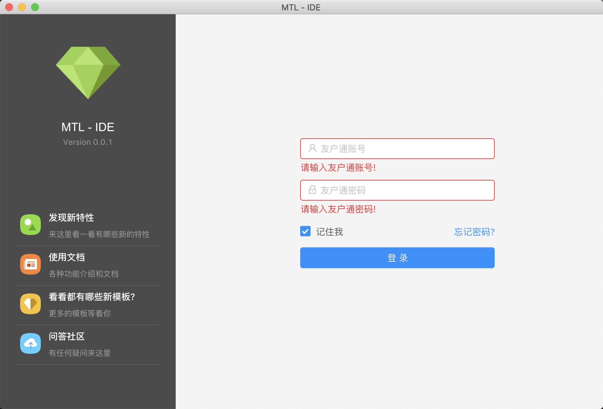

# mtl-ide

一款可视化跨平台前端集成开发工具，基于electron构建开发。支持微信、钉钉、Android、iOS等多端原生技术开发

## 如何下载

通过[Releases](https://github.com/mtl-team/mtl-IDE/releases)页面下的提示下载使用

## 截图

## 启动命令

1. `npm run dev`

启动`webpack`来运行开发任务、构建主线程资源、渲染线程资源

2. `npm start`

开启主程序`mtl IDE`

## 构建 & 生产

`npm run build`

然后使用以下命令：

- `npm run pack`            直接运行的MacOS包
- `npm run pack:mac`        构建macOS标准安装包(.dmg)
- `npm run pack:win`        构建Windows标准安装包(.exe)

